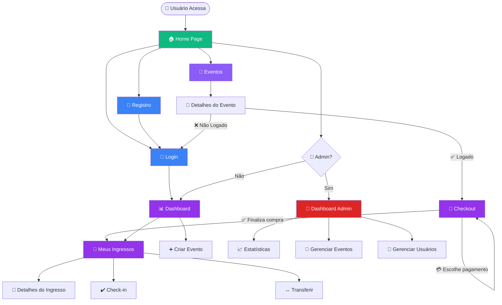

# 🗺️ Fluxo de Navegação - Gwan Events

Este documento descreve o fluxo completo de navegação da aplicação Gwan Events.

## Visualização do Fluxo



## Descrições Detalhadas dos Fluxos

### 🔄 Fluxo de Compra de Ingressos

**Cenário**: Usuário deseja comprar ingressos para um evento

1. **Exploração**
   - Home → Events → Filtra eventos → Clica em um evento
   - Redireciona para `/events/:id` (EventDetail)

2. **Seleção**
   - Visualiza detalhes do evento
   - Seleciona categoria de ingresso (Standard, Premium, VIP)
   - Define quantidade desejada

3. **Autenticação**
   - Clica em "Comprar Ingresso"
   - Se não estiver logado: redireciona para `/login`
   - Após login: retorna para o evento

4. **Checkout**
   - Redireciona para `/checkout`
   - **Seção 1**: Exibe ingressos selecionados
   - **Seção 2**: Formulário dinâmico para dados dos participantes
     - Para cada ingresso: Nome, Sobrenome, Email, CPF
     - Botão "Usar meus dados" para preenchimento automático
     - Validação de CPF com máscara automática
     - Validação de email
   - **Seção 3**: Resumo do pedido (quantidade, preço, total)
   - **Seção 4**: Seleção de método de pagamento
     - PIX
     - Cartão de Crédito (com parcelas até 12x)
     - Cartão de Débito

5. **Finalização**
   - Clica em "Finalizar Compra"
   - Sistema valida dados e processa pagamento
   - Redireciona para `/my-tickets`

### 🔐 Fluxo de Autenticação

**Cenário 1: Registro de Novo Usuário**

1. Home → Clica em "Registrar"
2. `/register` → Preenche formulário (nome, email, telefone, senha)
3. Clica em "Criar Conta"
4. Sistema valida dados
5. Alerta: "Conta criada com sucesso! Você será redirecionado para a tela de login."
6. Redireciona para `/login`
7. Faz login → Redireciona para `/` (Dashboard)

**Cenário 2: Login Direto**

1. Home → Clica em "Login"
2. `/login` → Insere email e senha
3. Clica em "Entrar"
4. Sistema valida credenciais
5. Redireciona para `/` (Dashboard)

### 👑 Fluxo Administrativo

**Cenário**: Admin acessa dashboard administrativo

1. Login como ADMIN
2. Dashboard detecta role ADMIN
3. Exibe link para `/admin`
4. Acesso ao Dashboard Admin com:
   - **Estatísticas Globais**: Usuários, eventos, ingressos, receita
   - **Gestão de Eventos**: Criar, editar, excluir eventos
   - **Gestão de Usuários**: Visualizar, editar, banir usuários
   - **Relatórios**: Analytics detalhados

### 📊 Fluxo de Visualização de Ingressos

**Cenário**: Usuário visualiza ingressos comprados

1. Logado → Clica em "Meus Ingressos"
2. Redireciona para `/my-tickets`
3. Lista todos os ingressos comprados
4. Para cada ingresso:
   - **Detalhes**: Evento, categoria, data
   - **Status**: Ativo, Usado, Cancelado
   - **QR Code**: Gerado automaticamente
   - **Ações**: 
     - "Fazer Check-in" (se status ACTIVE)
     - Ver QR Code
     - Transferir (se permitido)

## 📍 Pontos de Entrada da Aplicação

- **Home** (`/`): Página inicial
- **Events** (`/events`): Listagem de eventos
- **Login** (`/login`): Autenticação
- **Register** (`/register`): Registro
- **Dashboard** (`/dashboard`): Área do usuário
- **My Tickets** (`/my-tickets`): Ingressos comprados
- **Admin** (`/admin`): Dashboard administrativo

## 🔒 Páginas Protegidas

As seguintes páginas requerem autenticação:

- **Dashboard** (`/dashboard`)
- **My Tickets** (`/my-tickets`)
- **Checkout** (`/checkout`)
- **Admin** (`/admin`) - Requer role ADMIN

Se um usuário não autenticado tentar acessar, será redirecionado para `/login`.

## 🎨 Componentes de UI por Fluxo

### Compra de Ingressos
- `EventCard.tsx`: Card de evento
- `EventFilters.tsx`: Filtros de busca
- `EventDetail.page.tsx`: Detalhes do evento
- `Checkout.page.tsx`: Página de checkout
- `usePurchaseTicket.ts`: Hook de compra

### Autenticação
- `Login.page.tsx`: Página de login
- `Register.page.tsx`: Página de registro
- `AuthContext.tsx`: Contexto de autenticação
- `ProtectedRoute.tsx`: Rota protegida

### Gestão de Ingressos
- `MyTickets.page.tsx`: Lista de ingressos
- `TicketCard.tsx`: Card de ingresso
- `useCheckIn.ts`: Hook de check-in
- `useTickets.ts`: Hook de listagem

## 🚀 Interações Principais

| Ação | Origem | Destino | Autenticação Necessária |
|------|--------|---------|------------------------|
| Buscar evento | Home | Events | ❌ Não |
| Ver detalhes | Events | EventDetail | ❌ Não |
| Comprar ingresso | EventDetail | Checkout | ✅ Sim |
| Finalizar compra | Checkout | MyTickets | ✅ Sim |
| Ver ingressos | Dashboard | MyTickets | ✅ Sim |
| Fazer check-in | MyTickets | API | ✅ Sim |
| Criar evento | Dashboard | API | ✅ Sim (ORGANIZER) |
| Acessar admin | Dashboard | Admin | ✅ Sim (ADMIN) |

## 🔄 Ciclos de Navegação

### Ciclo de Compra Completo
```
Home → Events → EventDetail → Checkout → MyTickets → Home
```

### Ciclo de Autenticação
```
Home → Register → Login → Dashboard → Home
```

### Ciclo Administrativo
```
Login (ADMIN) → Dashboard → Admin → Dashboard
```

## 📝 Observações Importantes

1. **Checkout é a única página protegida no fluxo de compra**: EventDetail pode ser visualizado sem autenticação, mas para comprar é necessário login.

2. **Dados de participantes são coletados dinamicamente**: O formulário gera campos baseado na quantidade de ingressos selecionados.

3. **Validação client-side**: CPF e email são validados antes de enviar ao backend.

4. **Token JWT**: Após login bem-sucedido, o token é armazenado no localStorage e incluído em todas as requisições autenticadas.

5. **Redirecionamentos inteligentes**: Após login/registro, o usuário é redirecionado para onde estava antes.

---

**Gwan Events** - Conectando pessoas através de experiências únicas! 🎉

