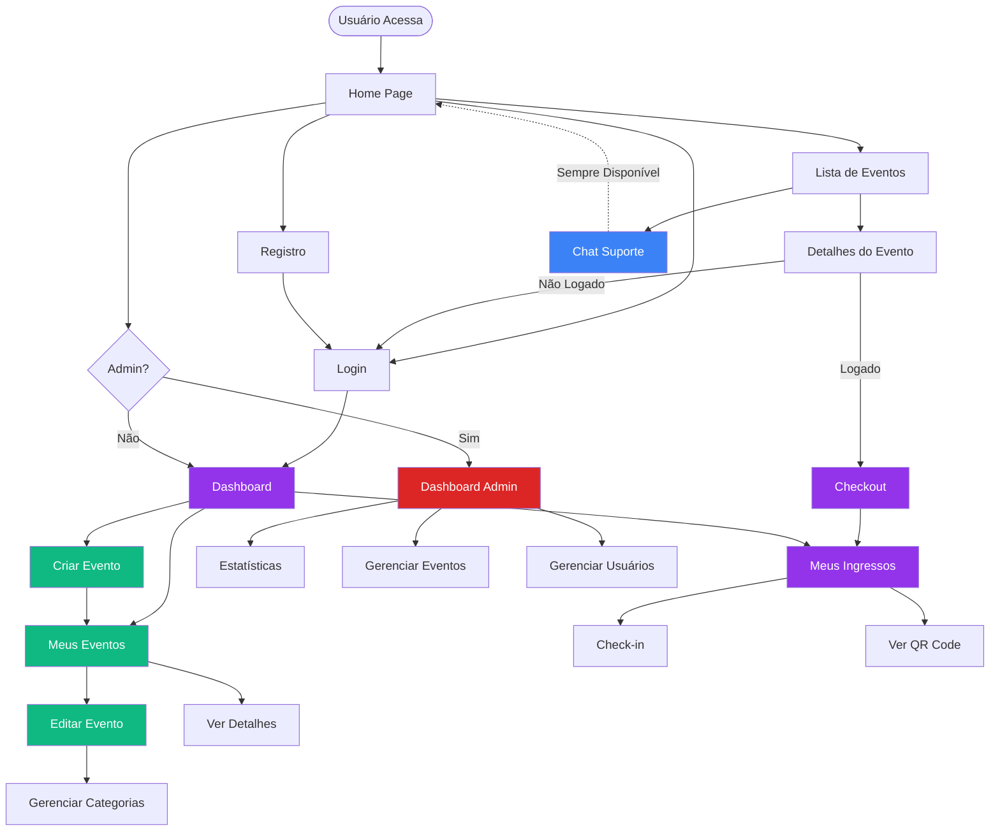
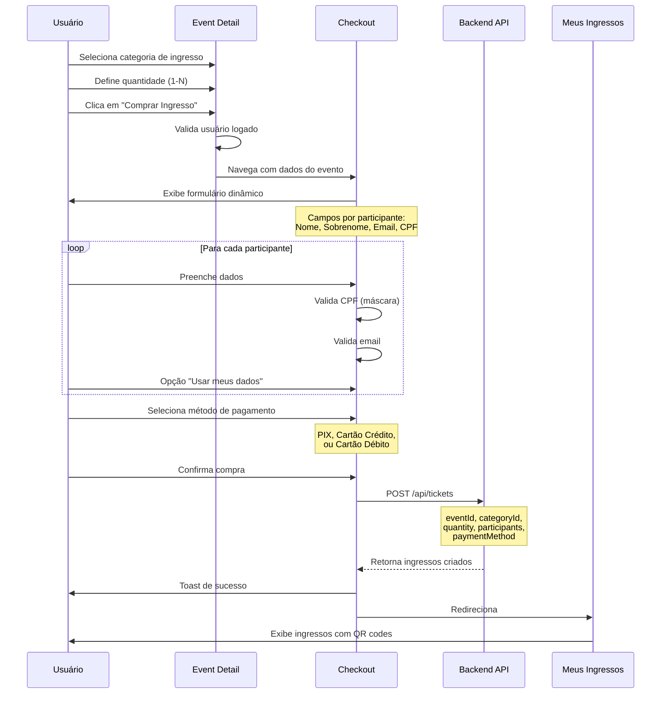
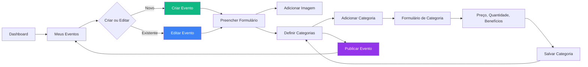

# 🚀 Gwan Events - Frontend

Frontend da plataforma de eventos e venda de ingressos, desenvolvido com React + TypeScript e Vite.

> **Backend**: [gwan-events-backend](https://github.com/rastamansp/gwan-events-backend)

## 🚀 Funcionalidades

### Para Participantes
- **Exploração de Eventos**: Navegue por eventos por categoria, cidade e data
- **Compra de Ingressos**: Sistema completo de compra com checkout e coleta de dados de participantes
- **Checkout Interativo**: Formulário dinâmico para coletar dados de cada participante com validação em tempo real
- **Pagamentos**: Suporte a PIX, cartão de crédito (com parcelas) e débito
- **Ingressos Digitais**: QR Code único para cada ingresso
- **Área do Cliente**: Dashboard pessoal com histórico de compras e ingressos
- **Transferência de Ingressos**: Possibilidade de transferir ingressos para outros usuários
- **Chat de Suporte**: Assistente virtual integrado para suporte ao cliente (24/7)

### Para Organizadores
- **Gestão de Eventos**: Criação e edição completa de eventos com informações detalhadas
- **Gerenciamento de Categorias**: Criação, edição e exclusão de categorias de ingressos para seus eventos
- **Página "Meus Eventos"**: Visualização e gerenciamento de todos os eventos criados
- **Categorias de Ingressos**: Diferentes tipos de ingressos (pista, VIP, estudante, etc.) com benefícios
- **Relatórios**: Analytics detalhados sobre vendas e participação
- **Painel Administrativo**: Interface completa para gerenciamento

### Para Administradores
- **Dashboard Completo**: Visão geral de toda a plataforma
- **Estatísticas**: Métricas de usuários, eventos, ingressos e pagamentos
- **Gestão de Usuários**: Controle completo sobre usuários e organizadores
- **Analytics Avançados**: Relatórios detalhados e insights

## 🛠️ Tecnologias Utilizadas

### Frontend
- **React 18**: Biblioteca para interfaces de usuário
- **TypeScript**: Tipagem estática
- **Vite**: Build tool moderno e rápido
- **React Router**: Roteamento de páginas
- **Tailwind CSS**: Framework CSS utilitário
- **Axios**: Cliente HTTP para comunicação com a API
- **Lucide React**: Ícones modernos e consistentes
- **Zod**: Validação de esquemas e tipos
- **react-hot-toast**: Sistema de notificações elegante
- **React Hook Form**: Gerenciamento de formulários
- **date-fns**: Manipulação e formatação de datas
- **Sentry**: Monitoramento de erros e performance

### Arquitetura
- **Clean Architecture**: Separação clara entre camadas de domínio, aplicação, infraestrutura e apresentação
- **SOLID Principles**: Princípios de design orientado a objetos
- **Repository Pattern**: Abstração de acesso a dados
- **Use Cases**: Lógica de negócio encapsulada
- **Dependency Injection**: Injeção de dependências para melhor testabilidade

> **Nota**: O backend está em um repositório separado: [gwan-events-backend](https://github.com/rastamansp/gwan-events-backend)

## 📁 Estrutura do Projeto (Clean Architecture)

```
gwan-events/
├── src/
│   ├── domain/                    # Camada de Domínio
│   │   ├── entities/             # Entidades de negócio
│   │   │   ├── Event.entity.ts
│   │   │   ├── User.entity.ts
│   │   │   ├── Ticket.entity.ts
│   │   │   └── Payment.entity.ts
│   │   ├── repositories/         # Interfaces dos repositórios
│   │   │   ├── IEventRepository.ts
│   │   │   ├── IAuthRepository.ts
│   │   │   ├── ITicketRepository.ts
│   │   │   ├── IChatRepository.ts
│   │   │   └── IPaymentRepository.ts
│   │   └── errors/               # Erros de domínio
│   │       └── DomainError.ts
│   ├── application/              # Camada de Aplicação
│   │   ├── use-cases/           # Casos de uso
│   │   │   ├── events/          # Use cases de eventos
│   │   │   │   ├── CreateEvent.usecase.ts
│   │   │   │   ├── UpdateEvent.usecase.ts
│   │   │   │   ├── ListEvents.usecase.ts
│   │   │   │   └── GetEventById.usecase.ts
│   │   │   ├── auth/            # Use cases de autenticação
│   │   │   │   ├── Login.usecase.ts
│   │   │   │   └── Register.usecase.ts
│   │   │   └── tickets/         # Use cases de ingressos
│   │   ├── dto/                 # Data Transfer Objects
│   │   │   ├── CreateEventDto.ts
│   │   │   ├── CreateTicketCategoryDto.ts
│   │   │   ├── LoginDto.ts
│   │   │   ├── RegisterDto.ts
│   │   │   ├── ParticipantData.ts
│   │   │   ├── PurchaseTicketDto.ts
│   │   │   └── ChatMessageDto.ts
│   │   └── validators/          # Validadores Zod
│   ├── infrastructure/           # Camada de Infraestrutura
│   │   ├── repositories/        # Implementações dos repositórios
│   │   │   ├── EventRepository.ts
│   │   │   ├── AuthRepository.ts
│   │   │   ├── TicketRepository.ts
│   │   │   ├── ChatRepository.ts
│   │   │   └── PaymentRepository.ts
│   │   ├── logging/            # Sistema de logging
│   │   │   ├── ILogger.ts
│   │   │   ├── SentryLogger.ts
│   │   │   └── ConsoleLogger.ts
│   │   ├── http/               # Cliente HTTP
│   │   └── storage/            # Storage local
│   ├── presentation/           # Camada de Apresentação
│   │   ├── hooks/             # Custom hooks
│   │   │   ├── useEvents.ts
│   │   │   ├── useEventDetail.ts
│   │   │   ├── useCreateEvent.ts
│   │   │   ├── useUpdateEvent.ts
│   │   │   ├── useTicketCategories.ts
│   │   │   ├── useTicketCategoryManagement.ts
│   │   │   ├── usePurchaseTicket.ts
│   │   │   ├── useTickets.ts
│   │   │   ├── useCheckIn.ts
│   │   │   ├── useChat.ts
│   │   │   └── useAuth.ts
│   │   ├── components/        # Componentes React
│   │   │   ├── chat/           # Componentes de chat
│   │   │   │   ├── ChatWidget.tsx
│   │   │   │   └── ChatWindow.tsx
│   │   │   ├── events/         # Componentes de eventos
│   │   │   │   ├── EventCard.tsx
│   │   │   │   └── EventFilters.tsx
│   │   │   ├── common/         # Componentes comuns
│   │   │   └── layout/         # Componentes de layout
│   │   ├── pages/            # Páginas da aplicação
│   │   │   ├── Home.page.tsx
│   │   │   ├── Events.page.tsx
│   │   │   ├── EventDetail.page.tsx
│   │   │   ├── CreateEvent.page.tsx
│   │   │   ├── EditEvent.page.tsx
│   │   │   ├── MyEvents.page.tsx
│   │   │   ├── Checkout.page.tsx
│   │   │   ├── MyTickets.page.tsx
│   │   │   ├── Dashboard.page.tsx
│   │   │   ├── AdminDashboard.page.tsx
│   │   │   ├── Login.page.tsx
│   │   │   └── Register.page.tsx
│   │   └── contexts/         # Contextos React
│   │       └── AuthContext.tsx
│   ├── shared/              # Código compartilhado
│   │   ├── di/             # Container de injeção de dependências
│   │   │   └── container.ts
│   │   ├── constants/      # Constantes
│   │   └── utils/          # Utilitários
│   ├── components/         # Componentes compartilhados
│   │   ├── Layout.tsx
│   │   ├── Header.tsx
│   │   ├── Footer.tsx
│   │   └── ProtectedRoute.tsx
│   ├── contexts/           # Contextos globais
│   │   └── AuthContext.tsx
│   ├── App.tsx            # Componente principal
│   ├── main.tsx           # Arquivo de entrada
│   └── index.css          # Estilos globais
├── public/               # Arquivos estáticos
├── package.json          # Dependências e scripts
├── vite.config.ts        # Configuração do Vite
├── tailwind.config.js    # Configuração do Tailwind
├── tsconfig.json         # Configuração do TypeScript
├── Dockerfile            # Configuração Docker
└── nginx.conf            # Configuração Nginx
```

## 🚀 Como Executar

### Pré-requisitos
- Node.js 18+ 
- npm ou yarn

### Instalação

1. **Clone o repositório**
```bash
git clone https://github.com/rastamansp/gwan-events.git
cd gwan-events
```

2. **Instale as dependências**
```bash
npm install
```

3. **Configure as variáveis de ambiente**
```bash
cp .env.example .env
```

4. **Execute o projeto em modo desenvolvimento**
```bash
npm run dev
```

O frontend será iniciado na porta 3000 (http://localhost:3000)

### Executando com Backend

Para uma experiência completa, você também precisa do backend:

1. **Clone o repositório do backend**
```bash
git clone https://github.com/rastamansp/gwan-events-backend.git
cd gwan-events-backend
npm install
npm run start:dev
```

2. **Configure a URL da API no frontend**
```env
VITE_API_URL=http://localhost:3001/api
```

### Executando apenas o Frontend

Se você quiser executar apenas o frontend (modo standalone):

```bash
npm run dev
```

O frontend funcionará em modo de desenvolvimento, mas as funcionalidades que dependem da API não estarão disponíveis.

## 📚 Documentação da API

A documentação completa da API está disponível em `/api` quando o backend estiver rodando. Ela inclui:

- **Endpoints de autenticação**: Login, registro, refresh token
- **CRUD de eventos**: Listagem, criação, edição, exclusão
- **Gestão de ingressos**: Compra, visualização, transferência
- **Sistema de pagamentos**: Processamento de pagamentos
- **Funcionalidades administrativas**: Dashboard, relatórios, analytics
- **Checkout**: Compra de ingressos com dados de participantes

## 🔐 Autenticação

O sistema utiliza JWT (JSON Web Tokens) para autenticação. Os usuários podem:

- **Registrar-se** com nome, email e senha
- **Fazer login** com email e senha
- **Acessar áreas protegidas** com token válido
- **Diferentes níveis de acesso**: USER, ORGANIZER, ADMIN

## 🎫 Sistema de Ingressos

### Funcionalidades
- **QR Code único** para cada ingresso
- **Validação em tempo real** na entrada do evento
- **Transferência de ingressos** entre usuários
- **Histórico completo** de compras e uso
- **Status tracking**: Ativo, Usado, Cancelado, Transferido

### Categorias de Ingressos
- Diferentes tipos (Pista, VIP, Estudante, etc.)
- Preços personalizados
- Benefícios específicos por categoria
- Controle de lotes e disponibilidade

### Processo de Compra (Checkout)
- **Seleção de Ingressos**: Escolha da categoria e quantidade desejada
- **Checkout com Dados de Participantes**: 
  - Formulário dinâmico que gera campos para cada participante
  - Botão "Usar meus dados" para preenchimento automático
  - Validação de CPF com máscara automática
  - Validação de email
- **Seleção de Método de Pagamento**:
  - PIX (pagamento instantâneo)
  - Cartão de Crédito (com opção de parcelamento até 12x)
  - Cartão de Débito
- **Resumo do Pedido**: Visualização clara de quantidade, preço unitário e total

## 💳 Sistema de Pagamentos

### Métodos Suportados
- **PIX**: Pagamento instantâneo com QR Code
- **Cartão de Crédito**: Com opção de parcelamento
- **Cartão de Débito**: Pagamento à vista
- **Carteiras Digitais**: Integração com sistemas de pagamento

### Status de Pagamento
- **PENDING**: Aguardando aprovação
- **APPROVED**: Pagamento aprovado
- **REJECTED**: Pagamento rejeitado
- **REFUNDED**: Pagamento reembolsado

## 📊 Analytics e Relatórios

### Dashboard Administrativo
- **Métricas de usuários**: Total, organizadores, clientes
- **Estatísticas de eventos**: Ativos, esgotados, cancelados
- **Análise de ingressos**: Vendidos, usados, cancelados
- **Receita**: Total, mensal, crescimento

### Relatórios por Evento
- Vendas por categoria de ingresso
- Taxa de comparecimento
- Receita por método de pagamento
- Análise temporal de vendas

## 🎨 Design e UX

### Características
- **Design Responsivo**: Mobile-first approach
- **Interface Moderna**: Inspirada em plataformas de streaming
- **Experiência Intuitiva**: Navegação simples e clara
- **Acessibilidade**: Componentes acessíveis e inclusivos

### Componentes Principais
- **Layout Responsivo**: Header, conteúdo principal, footer
- **Cards de Eventos**: Apresentação visual atrativa
- **Formulários**: Validação em tempo real
- **Modais e Notificações**: Feedback visual para ações

## 🔧 Configuração e Personalização

### Variáveis de Ambiente

**Frontend (.env):**
```env
VITE_API_URL=http://localhost:3001/api
VITE_APP_NAME=Gwan Events
VITE_APP_VERSION=1.0.0
VITE_NODE_ENV=development
VITE_SENTRY_DSN=your-sentry-dsn-here
```

### Customização
- **Temas**: Cores e estilos personalizáveis via Tailwind
- **Configurações**: Parâmetros ajustáveis para diferentes ambientes
- **Integrações**: APIs externas facilmente integradas

## 🧪 Dados Mock

O projeto inclui dados simulados para demonstração:

- **Usuários**: Admin, organizadores e clientes de exemplo
- **Eventos**: Festival de música, workshop de programação
- **Ingressos**: Diferentes categorias e status
- **Pagamentos**: Transações simuladas com diferentes métodos
- **Checkout**: Fluxo completo de compra com participantes

## 🗺️ Fluxos da Aplicação

### Fluxo de Navegação Geral

O diagrama abaixo mostra o fluxo de navegação completo da aplicação:



### Fluxo de Compra de Ingressos

Diagrama detalhado do processo completo de compra:



### Fluxo de Gerenciamento de Eventos

Diagrama para organizadores criarem e gerenciarem eventos:



## 🚀 Deploy e Produção

### Build para Produção
```bash
npm run build
```

### Docker
```bash
docker build -t gwan-events-frontend .
docker run -p 80:80 gwan-events-frontend
```

### Deploy com Docker Compose
```bash
docker-compose up -d
```

### Variáveis de Ambiente de Produção
- Configure URLs de produção
- Configure CORS adequadamente
- Configure logs e monitoramento
- Configure Sentry para produção

## 🤝 Contribuição

1. Fork o projeto
2. Crie uma branch para sua feature (`git checkout -b feature/AmazingFeature`)
3. Commit suas mudanças (`git commit -m 'Add some AmazingFeature'`)
4. Push para a branch (`git push origin feature/AmazingFeature`)
5. Abra um Pull Request

## 📄 Licença

Este projeto está sob a licença MIT. Veja o arquivo `LICENSE` para mais detalhes.

## 📚 Documentação Adicional

- **[Fluxo de Navegação](./FLUXO-NAVEGACAO.md)**: Diagrama e descrições detalhadas do fluxo da aplicação
- **[Deploy](./DEPLOY.md)**: Instruções para deploy em produção
- **[Deploy Produção](./DEPLOY-PRODUCTION.md)**: Configurações específicas de produção

## 📱 Chat de Suporte

### Funcionalidades
- **Disponível 24/7**: Assistente virtual sempre disponível em todas as páginas
- **Interface Flutuante**: Botão de acesso rápido no canto inferior direito
- **Histórico de Conversa**: Mantém histórico durante a sessão do usuário
- **Respostas Inteligentes**: Integração com backend para respostas contextuais
- **Múltiplas Ferramentas**: Chat pode executar ações através de tools (funções)

### Tecnologia
- Integração via `/api/chat`
- Renderização de Markdown básico
- Indicador de digitação
- Notificações elegantes com react-hot-toast

## 📝 Sistema de Notificações

### Notificações Toast
O projeto utiliza `react-hot-toast` para todas as notificações:

- **Toast de Sucesso**: Operações bem-sucedidas (verde)
- **Toast de Erro**: Erros e falhas (vermelho)
- **Toast de Aviso**: Avisos importantes (amarelo)
- **Toast de Info**: Informações relevantes (azul)

### Configuração
```typescript
<Toaster
  position="top-right"
  toastOptions={{
    duration: 4000,
    style: { background: '#363636', color: '#fff' },
    success: { duration: 3000 },
    error: { duration: 4000 }
  }}
/>
```

## 🔄 Validações

### Validações Implementadas
- **CPF**: Máscara automática e validação de formato
- **Email**: Validação de formato com regex
- **Campos Obrigatórios**: Identificação e bloqueio de campos vazios
- **Validação em Tempo Real**: Feedback instantâneo ao usuário
- **Validação de Zod**: Esquemas de validação centralizados

## 📞 Suporte

Para suporte e dúvidas:
- Email: contato@gwanshop.com
- Documentação: http://localhost:3001/api (quando backend estiver rodando)
- Chat de Suporte: Disponível no canto inferior direito de todas as páginas

---

**Gwan Events** - Conectando pessoas através de experiências únicas! 🎉